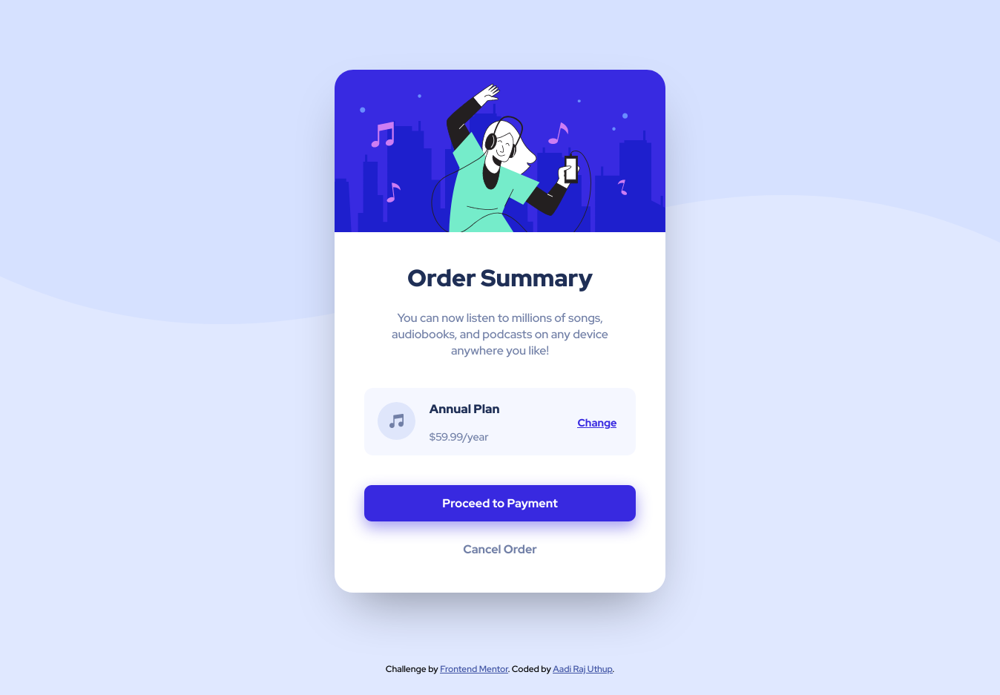

# Frontend Mentor - Order summary card solution

This is a solution to the [Order summary card challenge on Frontend Mentor](https://www.frontendmentor.io/challenges/order-summary-component-QlPmajDUj). Frontend Mentor challenges help you improve your coding skills by building realistic projects. 

## Table of contents

- [Overview](#overview)
  - [The challenge](#the-challenge)
  - [Screenshot](#screenshot)
  - [Links](#links)
- [My process](#my-process)
  - [Built with](#built-with)
  - [What I learned](#what-i-learned)
  - [Continued development](#continued-development)
  - [Useful resources](#useful-resources)
- [Author](#author)

## Overview
I used to do some HTML and CSS for web design competitions in my school and didn't really get really deep into it. Recently I wanted to learn how to make webapps and all that. I forgot most of what I learnt. It wasn't that much could barely make a navbar cause I didn't understand the baics at the time. So here I am learnt HTML and CSS within I think about 4-5h or so and everything but enough to make this project.
### The challenge

Users should be able to:

- See hover states for interactive elements

### Screenshot

### Links

- Solution URL: [GitHub](https://github.com/aadirajuthup/order-summary-component)
- Live Site URL: [GitHub Pages](https://aadirajuthup.github.io/order-summary-component/)

## My process

I started with first creating the HTML boiler platecode with VS Code. I added all the text and linked to the Red Hat Display fonts in the head section. In CSS tried to add the background pattern, it was a little bit tough to figure out have to also have another color instead of white for the rest of the background. Once that was done I added the hero image and formatted the text using h1, h3, p and a tags. The rest I was going step by step looking at the design and correcting my code from top to bottom as in I started by centering the card and making sure the whole card and image would kinda retain it's size and shape when resizing the window. Then worked my way down to the Order Summary text and so on and so forth. Each step along the way making sure that that part of my implementation matched the actual design.

### Built with

- HTML5 markup
- CSS Design using divs and floats
- Google Fonts

### What I learned

I learned more than I could with any YouTube tutorial and other resources ever could. Building real projects is the key is so true

### Continued development

I have to learn to make the shadows then I'll add them to the project(Completed). I made a kind of responsive site but not as responsive as I wanted it to be. I'll fix that later on as I learn more. I did everything here to the best of my abilities. Finishing off I would try to reimplement everything with flexbox.

### Useful resources

- [W3Schools](https://w3schools.com) - I did almost all the excercises they had which really helped me in understanding everthing about HTML and CSS in a much deeper level.
- [FreeCodeCamp](https://freecodecamp.org) - I also did a lot of practice at FreeCodeCamp. Every single student has to check out FreeCodeCamp there is probably no other better resource in the internet than FreeCodeCamp.(for free of cource)
- [CodeWithHarry Youtube Channel](https://www.youtube.com/channel/UCeVMnSShP_Iviwkknt83cww) - This whole channel is in Hindi. There is a playlist containing HTML & CSS. He only brushes over the basics you are going to need and I found that useful in identifying what I should focus on first and getting that inital boost to get started as fast as possible.

## Author

- Website - [Atomsoft](https://atomsoft.in)
- Frontend Mentor - [@aadirajuthup](https://www.frontendmentor.io/profile/aadirajuthup)